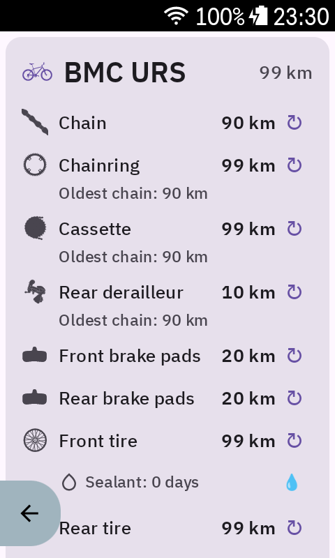

# WearTracker

A [Karoo](https://www.hammerhead.io/karoo) extension that tracks wear and mileage on bicycle drivetrain components, brakes, and tires.

<p align="center">
  
</p>

## Features

- **Per-bike tracking** — automatically detects bikes configured on your Karoo and tracks each independently
- **Drivetrain**: chain, chainring, cassette, rear derailleur, front derailleur
- **Brakes**: front and rear brake pad distance
- **Tires**: front and rear tire distance, plus sealant age (days since last refresh)
- **Frame mileage** — displays total odometer from the Karoo (non-resettable)
- **Chain replacement intelligence** — when you replace a chain, the app records the longest chain used on the cassette, chainring, and derailleurs to help you decide when to replace those components
- **Front derailleur auto-detection** — automatically shown for bikes with more than one front gear
- **Data fields** — 11 custom data types that can be added to ride pages on the Karoo

## How it works

The Karoo provides a per-bike odometer (total distance in meters). WearTracker stores an *offset* for each component — the odometer reading at the time of installation. Wear is computed on the fly:

```
component distance = bike odometer − component offset
```

When you replace a component, the offset is reset. No background service or distance tracking is needed.

## Data types

| Field | Unit | Description |
|---|---|---|
| Chain Wear | km / mi | Distance on the current chain |
| Chainring Wear | km / mi | Chainring distance since last replacement |
| Cassette Wear | km / mi | Cassette distance since last replacement |
| RD Wear | km / mi | Rear derailleur distance |
| FD Wear | km / mi | Front derailleur distance (hidden if no FD) |
| Front Brake Pads | km / mi | Front brake pad distance |
| Rear Brake Pads | km / mi | Rear brake pad distance |
| Front Tire | km / mi | Front tire distance |
| Rear Tire | km / mi | Rear tire distance |
| Front Sealant | days | Days since front tire sealant was refreshed |
| Rear Sealant | days | Days since rear tire sealant was refreshed |

Units follow the Karoo's user preference (metric or imperial).

## Building

Requires JDK 17 and the Android SDK (compileSdk 34).

```bash
./gradlew app:assembleRelease
```

The karoo-ext library (v1.1.8) is resolved from Maven local or GitHub Packages.

## Installing

Connect a Karoo via USB with developer mode enabled, then:

```bash
adb install -r app/build/outputs/apk/release/app-release.apk
```

## Image credits

- [Chainset.svg](https://commons.wikimedia.org/wiki/File:Chainset.svg) by [SyntaxTerror](https://commons.wikimedia.org/wiki/User:SyntaxTerror), [CC0 1.0](https://creativecommons.org/publicdomain/zero/1.0/)
- [Derailleur Bicycle Drivetrain labeled.svg](https://commons.wikimedia.org/wiki/File:Derailleur_Bicycle_Drivetrain_labeled.svg) by [Keithonearth](https://commons.wikimedia.org/wiki/User:Keithonearth) (diagram) and [MaligneRange](https://commons.wikimedia.org/wiki/User:MaligneRange) (labels), [CC BY-SA 3.0](https://creativecommons.org/licenses/by-sa/3.0)
- [Bicycle diagram.svg](https://commons.wikimedia.org/wiki/File:Bicycle_diagram.svg) by [Al2](https://commons.wikimedia.org/wiki/User:Al2), [CC BY 3.0](https://creativecommons.org/licenses/by/3.0)

## License

This project is not affiliated with Hammerhead. Karoo and Hammerhead are trademarks of SRAM LLC.
